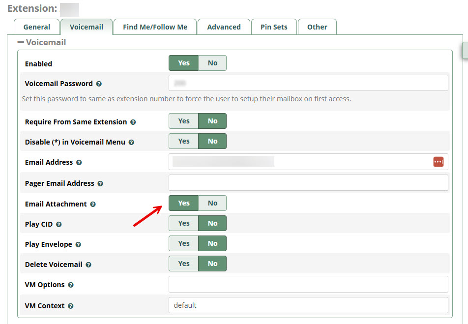
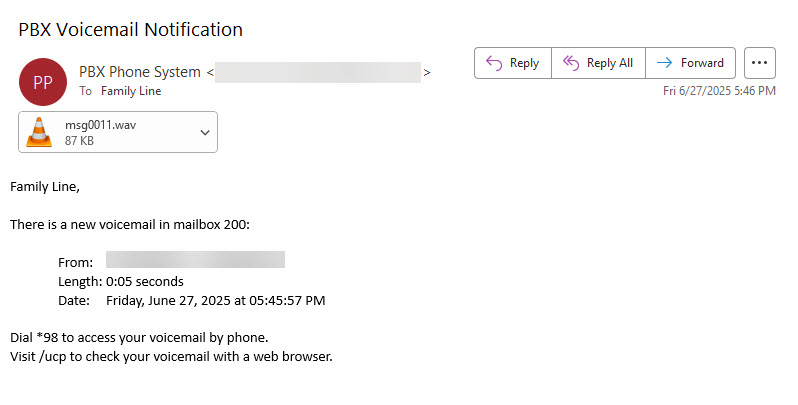

# Prerequisites

We assume that the latest FreePBX (version 17) is installed on a Debian-based system (Debian 12 in this example).

## Enable Voicemail for Your Extension

Open the FreePBX web interface.

Navigate to Connectivity → Extensions.

Select the extension you want to configure.

Go to the Voicemail tab and ensure the following:

- Voicemail Status: Enabled
- Email Address: Set to a valid address
- Email Attachment: Enabled

To test voicemail functionality, you can dial `*97` from the configured device. If this is the first time using voicemail on the extension, FreePBX will prompt you to record a name and greeting.

FreePBX uses the "Comedian Mail" module for handling voicemail. This component is part of the Asterisk PBX core and is responsible for recording, storing, and notifying users about new voicemail messages. You can verify that it is running by executing:

    sudo asterisk -x "module show like voicemail"

Example output:

    Module                         Description                              Use Count  Status      Support Level
    app_voicemail.so               Comedian Mail (Voicemail System)         0          Running              core
    res_pjsip_send_to_voicemail.so PJSIP REFER Send to Voicemail Support    0          Running              core
    2 modules loaded

When a voicemail is received, FreePBX automatically sends an email to the configured address with the voice message attached.

## Integration with Speak-IO STT Service

This project relies on an external Speech-to-Text (STT) service provided by the [Speak-IO](https://github.com/ManiAm/Speak-IO) project. Make sure the STT API is running and accessible from your FreePBX host. To verify that the service is available, run the following from the Debian host:

    curl "http://<ip-address>:5000/api/stt/models"

## Accessing STT from WSL

If the STT service is running inside WSL (Windows Subsystem for Linux), you must forward the STT service port (5000) to your Windows LAN IP so the FreePBX host can access it.

Get the WSL IP:

    wsl hostname -I

Example: 172.29.198.1

Forward port 5000 to your WSL IP using Windows portproxy:

    netsh interface portproxy add v4tov4 listenaddress=0.0.0.0 listenport=5000 connectaddress=172.29.198.1 connectport=5000

Determine your Windows LAN IP (not the WSL IP):

    ipconfig

Test access from the FreePBX host:

    curl "http://192.168.2.130:5000/api/stt/models"

Replace 192.168.2.130 with your actual Windows LAN IP address.
