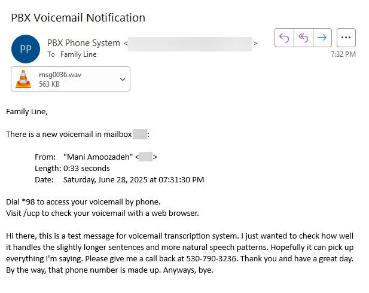

# Transcribe-Voicemail

This project enables automatic transcription of received voicemails. Built to integrate with [FreePBX’s](https://www.freepbx.org/) voicemail-to-email functionality, this solution enhances accessibility and convenience by converting voice messages into text before they reach the recipient.

The system works by intercepting voicemail notification emails before they are sent. It extracts the audio attachment (typically a .wav file), performs local speech-to-text transcription using [Speak-IO](https://github.com/ManiAm/Speak-IO) project, and appends the resulting transcript to the body of the email. The modified email is then forwarded to the original recipient, now containing both the original audio file and a readable transcription of its contents.

FreePBX is deployed within a virtualized environment on my home network, providing a fully self-hosted, privacy-preserving communication platform. For details on the FreePBX setup and network environment, refer to [here](https://blog.homelabtech.dev/content/Self-hosted_PBX.html).

## Getting Started

Make sure to go over all prerequisites outlined in the [Prerequisites](Prerequisites.md) document before proceeding.

Begin by connecting to your FreePBX host and install the required dependency:

    sudo apt install jq

Clone the project repository to your FreePBX host:

    cd ~
    https://github.com/ManiAm/Transcribe-Voicemail
    cd Transcribe-Voicemail

Install the email intercept bash script:

    cp mail-process.sh /usr/local/bin
    chmod +x /usr/local/bin/mail-process.sh
    chown asterisk:asterisk /usr/local/bin/mail-process.sh

Open FreePBX web interface and go to Settings -> Voicemail Admin -> Settings -> Email Config

In the Email Body field, add the `{TRANSCRIPTION}` placeholder. This will be replaced with the transcribed text.

Set the "Mail Command" value to **/usr/local/bin/mail-process.sh**

Click "Submit" and "Apply Config"

Launch the FastAPI-based REST server that handles voicemail parsing and transcription:

    python3 main.py

## Run as a systemd Service

To run the project in the background and start it on system boot:

1. Copy the service file:

```bash
sudo cp voicemail.service /etc/systemd/system/voicemail.service
```

2. Reload systemd and start the service:

```bash
sudo systemctl daemon-reexec
sudo systemctl daemon-reload
sudo systemctl enable voicemail
sudo systemctl start voicemail
```

3. Check status and logs:

```bash
sudo systemctl status voicemail
```

4. On service failure check the journal logs:

```bash
journalctl -u voicemail -n 50 --no-pager
```

Ensure that your virtual environment and script paths are correctly set in the service file.

## Demo

Here is a demonstration of the voicemail transcription workflow in action. I initiated a call to one of the SIP extensions configured in my home FreePBX system. As expected, since no one answered the call, the default unavailable greeting message was played. After the greeting, I proceeded to leave a short voicemail message.

[sample.mp4](https://github.com/user-attachments/assets/45e0e76c-d80f-4502-a4a2-189f82b10af6)

Once the voicemail was recorded, the system automatically triggered an email notification to the recipient configured for that extension. The email included the original voicemail audio as a `.wav` attachment, as well as the full transcription of the message embedded in the email body.


